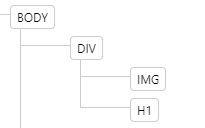
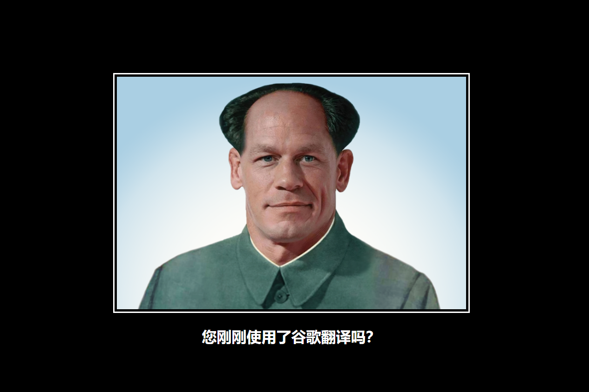

# Guide

- Create an HTML file inside the meme folder.
- In the assets folder theres an CSS folder inside it theres an `style.css`, link it to your HTML file.
- Change your HTML document title into `Meme`.
- Inside your HTML body, create an `div` element, this `div` will serve as a container of other HTML elements.
- Add a `class` name for your `div` for example `container`.
- Since you have named your `div` as `container` we going to refer to it as `container` from now on.
- Inside your `container` add a image element and a heading element.

- In your image element add a source image (you may use the provided image in your assets folder or get another image from online) use `src` attribute to set the image source.

- Now in your heading element add some text describing the image.

- Now you should have HTML element structure like this:

  

- Now we are going to design our HTML elements so make sure you properly link your CSS file in your HTML file.

- Take a look to the `goal.png`, the background color of the entire website needs to be black. so in this case you will need to change the `body` element background color into black and the text color into white.

  Hint:

  ```
  body {
      /* your css style goes here*/
  }
  ```

- The Image is too big adjust the `width` and `height` of the image element via inline or in your external CSS file, for example: set the `width` into `500px` and set the `height` into `500px`. just make sure you use the right css selector.

- If your image does not fit in your `img` element because of its `width` and `height`. Add another property called `object-fit: cover;` this will help your image to fit inside the `img` element.

- Take a look to the `goal.png` your image needs to have a border color white, to do that set the border property into `white` and 2 pixel wide.

- Take a look again to the `goal.png` your image also need to have spacing inside of it so use the `padding` property and set the value into 5 pixel this will give you a little space inside your element.

- Take a look to the `goal.png` you will see that the elements needs to be centered in your html document.

- If you look back to html structure you will see that the `body` element, only have an element and that element contains other elements. In this case, ONLY! in this case you are allowed adjust the `display` property of the `body` and set it into `flex`.

- Now that you set the `display` property of the `body` into `flex` you are now allowed to use the other `flex` properties, like `justify-content` and `align-item`. set these two properties into `center` since we want our elements inside the `body` to be centered. (`justify-content` will help you align your elements horizontally while `align-item` helps you to align your elements vertically.)

- And set the heading text alignment into center

- Does your elements centered but remained on the top of the screen? Thats because the body does not take the entire `height` of the screen to do that you need to set the `body` element, `height` property into `100vh` it represents 100% or the full height of your screen.

- Now you should have an output similar to this:

  
