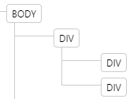
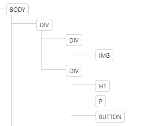
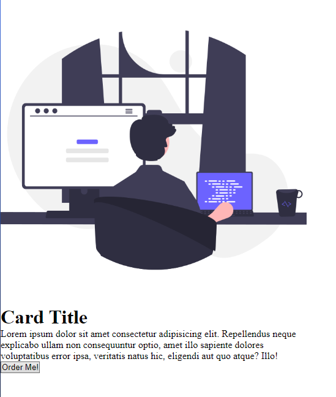
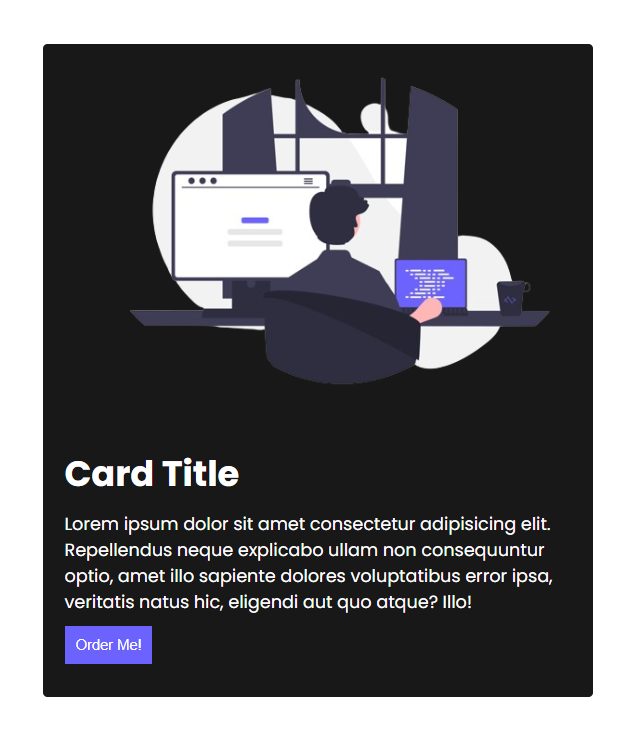
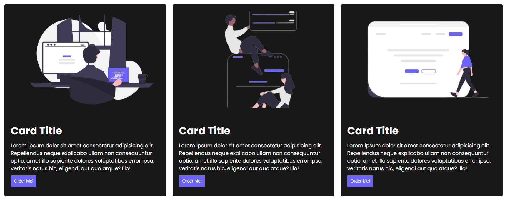

# How to create a cards?

- In this test we are going to create a simple card.

- First, we need to have a container that will contain all of our elements. For this, we are going to use a `<div>` element.

- Add a class name for that `<div>` element called card. From now on, we will refer to it as the `card` container.

- Inside the `card` container create 2 `<div>` element.

- the first `<div>` that we have inside the `card` container will contain the image for our `card` and second `<div>` will be containing the title and description of the `card`.

- Now in your first `div` inside the `card` container set the class name into `card-header`.

- And in your second `div` inside the `card` container set the class name into `card-body`.

- Now you should have a an html structure like this:

  

- Then in your `card-header` add a `` element

- Then add a source image for your `` element (use the `src` attribute to set the source image you may use the local files or use image from online sources);

- Now in your `card-body` add a `<h1>`, this element will represent the title for your card, now add a text inside of it (its up to you what put on it).

- Below `<h1>` element add paragraph element `<p>`, this element will contain all the decription for your card. now add a description for your card.

- Now add another element which is the `<button>` element under the `<p>` element, this button will act as clickable element in your card. add a text on it: "Order Now!".

- Now you should have a html structure like this:

  

## Designing The Card

- Make sure you link the css file properly.

- First we need to adjust the image `width` and `height` properties, try adjusting it into `500px` for both `width` and `height`. and set the `object-fit` property into `cover`, it will help your image to fit on the `width` and `height` of the image element.

- Now we another issue the text is to long, well thats because the `card` container is a `div`, as you remember `div` elements are block element they going to take the all the space available for them in this case the `card` took all the `width` of your screen we dont want that and so you need to adjust the `width` of your `card` container. Try the value of `200px`

  Hint:

  ```
  .card{
      width: your_value;

      /* or you can also use*/

      max-width: your_value;
  }
  ```

- Now your card should look like this:

  

- As you can see, the text inside the `card-body` does not have any space inside of it this not what we want, So adjust the `padding` property for your `card-body`, try adjusting into `10px`, you may adjust the way you want.

- Now lets add a space between each 3 elements in your `card-body` for that we are going to use the `margin` properties. try adjusting the `margin-bottom` property and set it into `10px`

  Hint:

  ```
  card-body > h1, p, button{
      /* adjust the property here */
  }
  ```

- Now lets design the `<button>` element. lets add spacing of inside of our element. to do that use `padding` property.

- change the background color of the `<button>` into this value: `#6C63FE` and change text color to `white`.

- the button looks ugly, lets try removing the `border` property so we can have a flat button. set the `border` property into `none`. and add the `cursor` property and set it into `pointer`, in this way the user can tell that the element is clickable.

- Now your card should look like this:

  

- Now lets change bakcground color of our `card` container, and change the text color into white.

- The corners for our `card` is to sharp, lets try adding `border-radius` property into our `card` element and lets try to set the value into `4px`.

# Extra Challenge

- As a challenge try putting your card in the center of the screen.
- create another 2 cards and put them in the center of the screen.

- 
