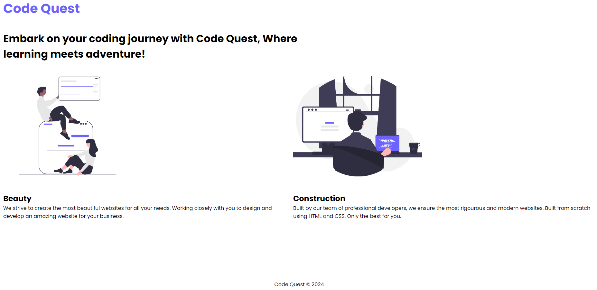

# Create a simple website

Now its your turn to create a simple website.

## What your website should look like

Here is the requirements:

- Logo: The company logo can be a text or image its up to you what you want to add.
- Heading: The heading, should have a simple message describing your website
- 2 Cards: These 2 cards should contains services that your website offers.
- Footer: just the name of your company and &copy; copyright year.

## Where to get vector art?

[Undraw](https://undraw.co/illustrations)

## Where to get free images?

[Unsplash](https://unsplash.com)
